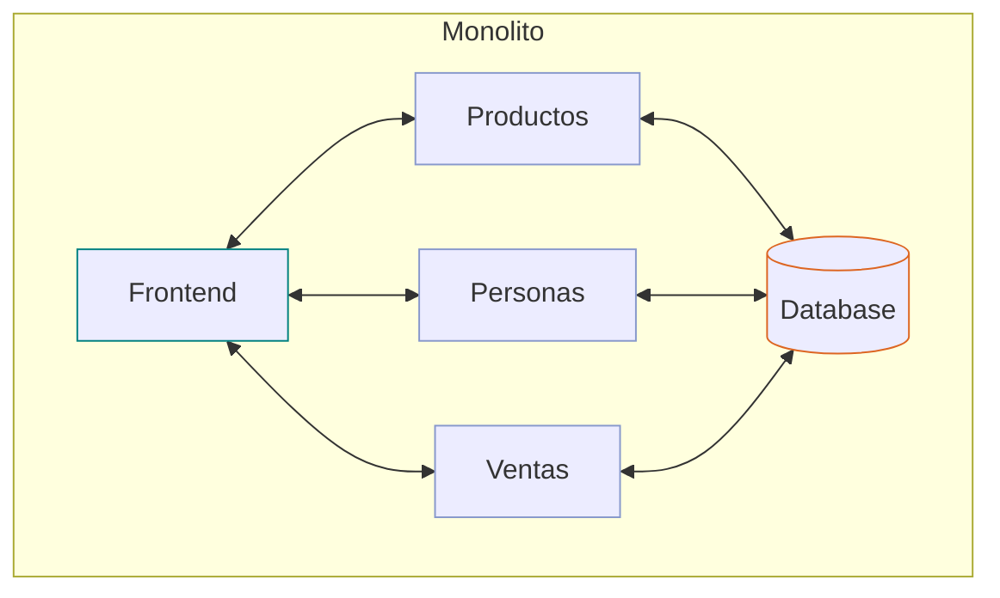
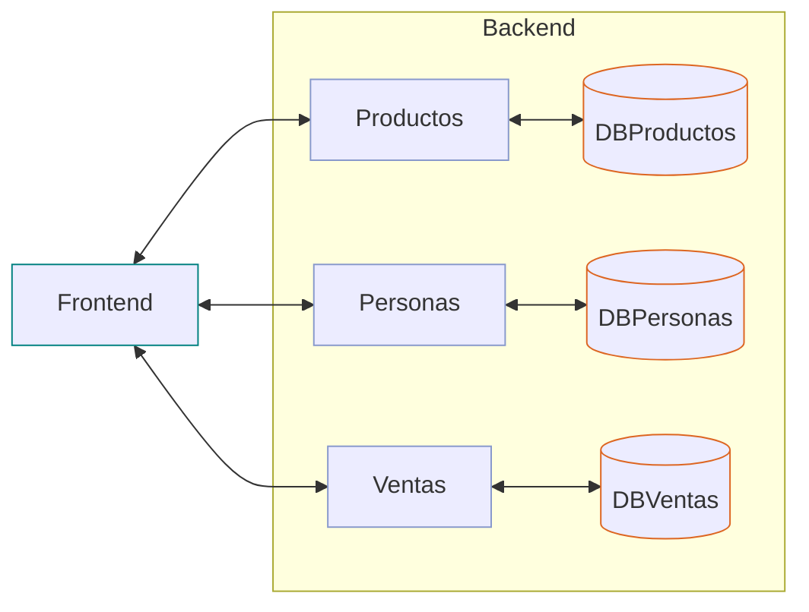
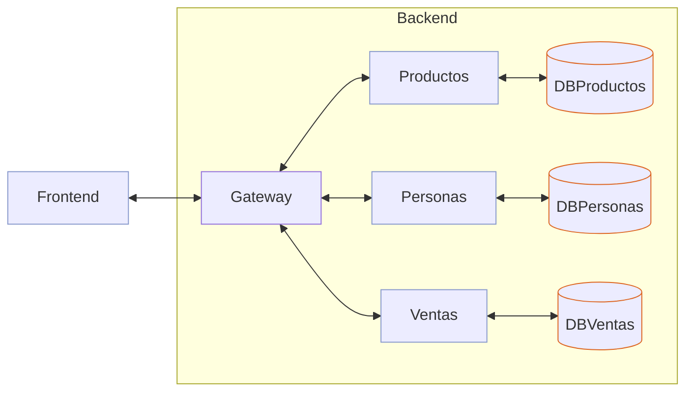

# Tienda 301 - Fastify

- **Tienda 101 - Fastify** es la versión monolito
    - [akobashikawa/tienda101-fastify: Ejercicio de implementar una tienda. Fastify con BDD. Arquitectura hexagonal. Monolito.](https://github.com/akobashikawa/tienda101-fastify).



- **Tienda 201 - Fastify** es una versión con microservicios invocados directamente
    - Cada microservicio tiene su propia base de datos
    - Ventas invoca a Productos y Personas usando métodos services
    - El frontend invoca directamente a cada microservicio directamente
    - [akobashikawa/tienda201-fastify: Ejercicio de implementar una tienda. Fastify con BDD. Arquitectura hexagonal. Microservicios.](https://github.com/akobashikawa/tienda201-fastify)



- **Tienda 301 - Fastify** es una versión con microservicios invocados a través de un gateway
    - Cada microservicio tiene su propia base de datos
    - Un service invoca a otros services por HTTP
    - El frontend invoca a un gateway y el gateway invoca a los microservicios



## Servicios

- **Gateway Service**
    - PORT: 3000

```sh
cd backend/gateway-service
npm install
npm test
npm run dev
```

- **Productos Service**
    - PORT: 3001

```sh
cd backend/productos-service
npm install
npm test
npm run dev
```

- **Personas Service**
    - PORT: 3002

```sh
cd backend/personas-service
npm install
npm test
npm run dev
```

- **Ventas Service**
    - PORT: 3003

```sh
cd backend/ventas-service
npm install
npm test
npm run dev
```

## Frontend

- Cada service tiene un frontend
- Para facilitar la prueba, el frontend del gateway es igual que el frontend general